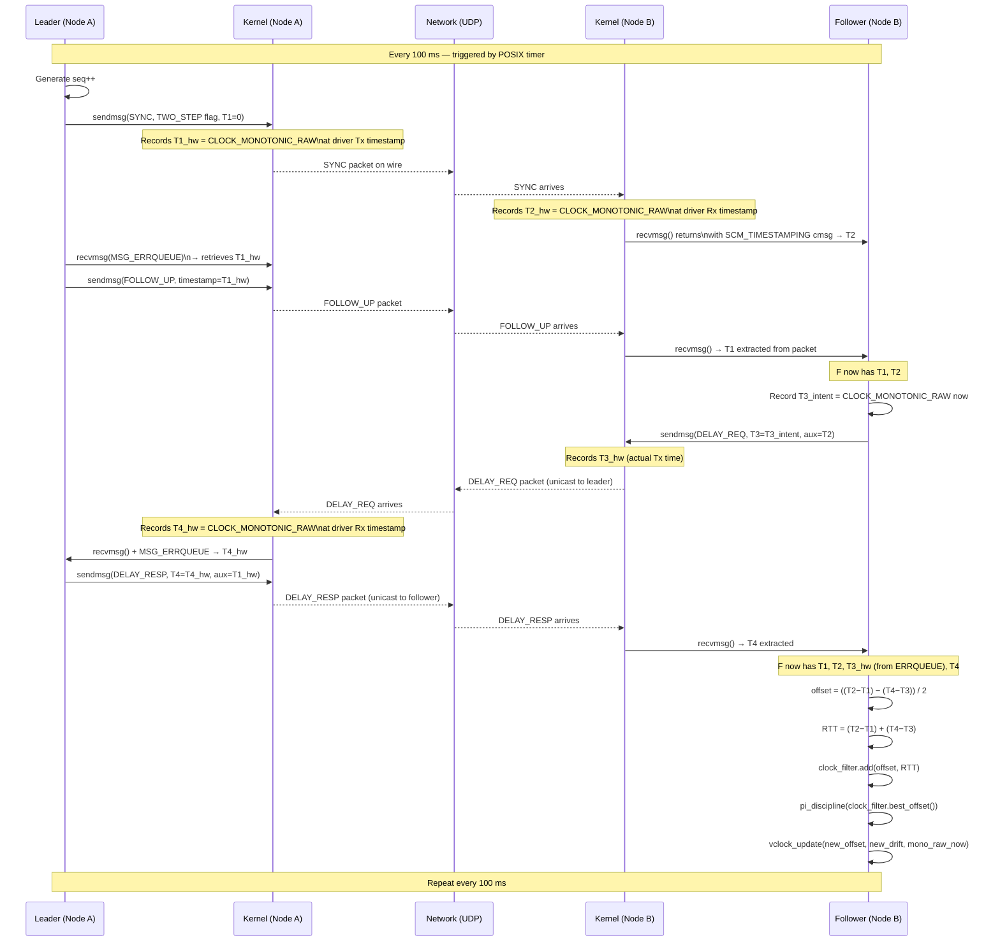

# DRS High-Precision User-Space Synchronization
## Phase 2 — Open Question Resolution & Architecture Anchor

---

## 1. Open Question Resolution (OQ-1 → OQ-12)

### OQ-1 — Precision definition
**Decision:** `P99 two-node offset < 100 μs` measured over any rolling 10-minute window containing at least 6 000 samples (100 ms sync interval × 600 exchanges).

| Metric | Value | Rationale |
|--------|-------|-----------|
| Statistic | P99 | Max is too sensitive to single outliers; mean hides tails. P99 matches PTP practice. |
| Measurement window | 10 min rolling | Matches Test Scenario 1 duration. |
| Sample rate | 100 ms | Derived from OQ-7. |
| Reference frame | Pair-wise between any two nodes | Guarantees global consistency, not just leader-to-follower. |

**Pass criterion for F-12:** The logic analyzer records all GPIO edges within a 1-second capture window. `max_edge − min_edge < 100 μs` for every trigger event.

---

### OQ-2 — SO_TIMESTAMPING permission
**Decision: PERMITTED.**

`SO_TIMESTAMPING` is a POSIX socket option set from user-space via `setsockopt()`. F-3 prohibits kernel *modules* and *drivers* — `SO_TIMESTAMPING` requires neither. It instructs the existing NIC driver to attach timestamps to the socket ancillary data (`CMSG`), which is read in user-space via `recvmsg()`.

`SCHED_FIFO` (via `pthread_setschedparam`) and `CAP_NET_ADMIN` (for `iw` power-save disable) are similarly within the user-space boundary and are explicitly permitted.

**Flags required:**
```
SOF_TIMESTAMPING_RX_SOFTWARE   — kernel software Rx timestamp (mandatory)
SOF_TIMESTAMPING_TX_SOFTWARE   — kernel software Tx timestamp (mandatory)
SOF_TIMESTAMPING_SOFTWARE      — enable software path
SOF_TIMESTAMPING_OPT_CMSG     — deliver timestamps as ancillary data
SOF_TIMESTAMPING_OPT_TSONLY   — do not copy payload for Tx reports
```
Hardware flags (`SOF_TIMESTAMPING_RX_HARDWARE`) are used opportunistically if the NIC reports capability; the code falls back to software timestamps without error.

---

### OQ-3 — Maximum cluster size
**Decision: 2 – 16 nodes, dynamically discovered.**

- UDP IPv4 multicast group `239.192.88.100` on port `47200` (administratively-scoped, locally unique).
- Multicast TTL = 1 (single LAN segment; no inter-subnet routing required).
- 16-node ceiling eliminates scalability concerns for this lab context; broadcast storm risk at TTL=1 is negligible.
- The discovery table is a fixed-size array of 16 `peer_entry_t` slots; overflow is logged as `ERR_PEER_TABLE_FULL`.

---

### OQ-4 — NTP / chrony interference
**Decision: `chronyd` and `systemd-timesyncd` MUST be disabled before the daemon starts.**

The deployment script (`deploy.sh`) executes on every node:
```bash
sudo systemctl disable --now chronyd systemd-timesyncd 2>/dev/null || true
```
The daemon itself verifies at startup that neither service is active (`systemctl is-active`) and exits with `ERR_NTP_CONFLICT` if either is running.

`CLOCK_MONOTONIC_RAW` is used as the sole time source, making the daemon immune to any residual `CLOCK_MONOTONIC` slewing if the check is bypassed.

---

### OQ-5 — Failover window
**Decision: Maximum 3 seconds, target < 1 second.**

| Phase | Duration | Notes |
|-------|----------|-------|
| Heartbeat miss detection | ≤ 3 × 100 ms = 300 ms | 3 missed heartbeats triggers election |
| Election round-trip | ≤ 300 ms | NOMINATE → ACK → VICTORY |
| New leader first SYNC | ≤ 100 ms | First exchange after VICTORY |
| Follower convergence | ≤ 2 000 ms | PI controller settles within 20 sync cycles |
| **Total worst case** | **≤ 2 700 ms** | Within 3 s budget |

During the election window, each node free-runs using:
```
virtual_time = mono_raw_now + last_known_offset + drift_ppb × Δt / 1e9
```
At 100 ppm drift for 3 s, maximum free-run error is 300 μs — a brief, bounded overshoot acceptable for this application.

---

### OQ-6 — Raspberry Pi revision
**Decision: Raspberry Pi 4B (BCM2711) is the minimum supported hardware.**

| Feature | RPi 3B | RPi 4B | Decision impact |
|---------|--------|--------|-----------------|
| NIC | USB LAN9514 | Native GbE BCM54213PE | RPi 4 has `ethtool -T` software timestamping |
| `SO_TIMESTAMPING` RX_SW | No | Yes | Required for sub-100 μs on Ethernet |
| USB jitter to NIC | Yes (500 μs–2 ms) | No | RPi 3 cannot meet F-1 on Ethernet |
| Wi-Fi | Onboard 802.11n | Onboard 802.11ac | Similar MAC jitter profile |

RPi 3 is explicitly **not supported**. The daemon prints `ERR_HARDWARE_UNSUPPORTED` if `ethtool -T` does not advertise at least `software-transmit` and `software-receive`.

---

### OQ-7 — Sync interval
**Decision: 100 ms (10 Hz).**

| Constraint | Calculation | Result |
|------------|-------------|--------|
| Max RPi crystal drift | 100 ppm | At 100 ms → 10 μs drift/interval |
| 100 μs budget fraction for drift | 50% (50 μs) | Leaves margin for filter lag |
| Network load (3 nodes, 2 role pairs) | ~240 bytes × 40 pkt/s × 3 nodes = ~28 kbps | Negligible |
| CPU load per exchange | ~5 μs per node | Negligible |

The interval is compile-time configurable via `SYNC_INTERVAL_MS` (default 100). It can be raised to 200 ms for Wi-Fi-only clusters where the additional drift margin is acceptable.

---

### OQ-8 — Wall-clock alignment
**Decision: Epoch-relative (cluster time), not UTC-aligned.**

- The leader's `CLOCK_MONOTONIC_RAW` reading at the moment it broadcasts its first SYNC message defines `T_epoch = 0`.
- All virtual clock values are nanoseconds since `T_epoch`.
- There is no GPS, PPS, or NTP seeding.
- Rationale: wall-clock alignment would require NTP (conflicts with OQ-4) or GPS hardware (not in scope). The 100 μs precision target is a *relative* synchronization requirement, not an absolute time requirement.
- The external verification procedure (OQ-9) uses virtual clock times directly — no UTC conversion needed.

---

### OQ-9 — External verification mechanism
**Decision: GPIO-triggered, USB logic analyzer capture.**

**Hardware:**
- Each RPi 4B node toggles GPIO pin 17 (`BCM` numbering) at a pre-agreed virtual clock time `T_trigger`.
- A Saleae Logic 8 (or equivalent 24 MHz+ USB logic analyzer) is connected to all GPIO-17 pins plus a shared ground.
- Alternatively: a 4-channel oscilloscope with USB export, or a Raspberry Pi running `pigpio` as a dedicated timestamp logger.

**Procedure:**
1. All nodes run the `drs_trigger` test harness with `T_trigger = cluster_time + 10_000_000_000` ns (10 seconds from now).
2. At `T_trigger`, each node calls `gpioWrite(17, 1)` inside the sync daemon's consumer API.
3. The logic analyzer captures with ≥ 1 MHz sample rate for 30 seconds.
4. Export CSV of all rising edges.

**Pass/fail criterion:**
```
max(edge_timestamps) − min(edge_timestamps) < 100 μs
```
This is independent of all software timestamps — it measures physical simultaneity at the GPIO hardware level.

**F-3 boundary:** GPIO access via `/sys/class/gpio` (user-space sysfs export) or the `gpiod` library (`libgpiod`) requires no kernel module. The `pigpio` library uses `/dev/mem` which requires a module — **use `gpiod` only**.

---

### OQ-10 — Jitter filter algorithm
**Decision: NTP Clock Filter + proportional-integral (PI) clock discipline.**

Rationale for rejection of alternatives:

| Algorithm | Pro | Con | Verdict |
|-----------|-----|-----|---------|
| Simple mean | Trivial | Catastrophic bias from Wi-Fi right tail | Rejected |
| Minimum RTT filter | Simple | Permanently biased toward short-path samples; cannot track drift | Rejected |
| Cristian's with outlier rejection | Moderate | Single-sample offset; no drift tracking | Insufficient alone |
| **NTP clock filter + PI discipline** | Proven, handles drift + jitter | Requires understanding of PLL/FLL concepts | **Selected** |
| Kalman filter | Optimal for Gaussian noise | Wi-Fi noise is not Gaussian; overfits | Overkill |

**Algorithm (see Section 3.3 for full specification):**
- Maintain a ring buffer of 8 `(RTT, offset_estimate)` samples.
- Select the sample with minimum RTT as the "best" sample (NTP RFC 5905 §11.1 clock filter).
- Feed the selected offset into a PI controller that slews the virtual clock.
- Apply an outlier gate: discard any sample where `|offset| > 10 ms` (ERR_CLOCK_RUNAWAY).

---

### OQ-11 — Network trust model
**Decision: Trusted network. No cryptographic authentication.**

- This is an isolated educational lab network (no internet-facing exposure).
- Basic sanity checks are enforced (magic bytes, version field, CRC-32, plausibility gate on offset).
- A "rogue" node is detected via the plausibility gate and its packets are ignored with `ERR_INVALID_TIMESTAMP` logged.
- No HMAC, no PKI. Adding TLS/DTLS would add 50–200 μs of processing jitter per packet — incompatible with the precision target.

---

### OQ-12 — Error taxonomy
**See Section 4 (Error Taxonomy Table) below.**

---

## 2. Architecture Anchor

### 2.1 Virtual Clock Model

#### Data Structure

```c
/* Seqlock-protected virtual clock state. Aligned to a cache line. */
typedef struct __attribute__((aligned(64))) {
    _Atomic uint32_t  seq;           /* seqlock sequence; odd = write in progress */
    uint32_t          _pad;
    int64_t           offset_ns;     /* estimated offset: leader_time - local_mono_raw */
    int64_t           drift_ppb;     /* local oscillator drift vs leader, parts-per-billion */
    uint64_t          mono_ref_ns;   /* CLOCK_MONOTONIC_RAW value at last discipline update */
    uint64_t          epoch_ref_ns;  /* leader's T_epoch in local mono_raw time */
    uint8_t           leader_id[16]; /* UUID of the current leader */
    uint32_t          leader_seq;    /* last SYNC sequence number seen from leader */
    uint8_t           state;         /* UNSYNC / SYNCING / SYNCED / FREERUN / ELECTING */
    uint8_t           _pad2[3];
} VirtualClock;
```

#### Read API (consumer)

```c
/* Seqlock read — retry if write in progress or torn. */
static inline uint64_t vclock_read_ns(const VirtualClock *vc) {
    uint32_t seq1, seq2;
    int64_t  offset, drift;
    uint64_t mono_ref, now_raw;
    do {
        seq1     = atomic_load_explicit(&vc->seq, memory_order_acquire);
        offset   = vc->offset_ns;
        drift    = vc->drift_ppb;
        mono_ref = vc->mono_ref_ns;
        seq2     = atomic_load_explicit(&vc->seq, memory_order_acquire);
    } while ((seq1 & 1) || seq1 != seq2);

    struct timespec ts;
    clock_gettime(CLOCK_MONOTONIC_RAW, &ts);
    now_raw = (uint64_t)ts.tv_sec * 1000000000ULL + ts.tv_nsec;

    int64_t dt  = (int64_t)(now_raw - mono_ref);
    int64_t adj = drift * (dt / 1000) / 1000000; /* ppb × μs → ns */
    return (uint64_t)((int64_t)now_raw + offset + adj);
}
```

#### Write path (sync thread only)

```c
/* Called from the sync thread after each discipline update. */
static void vclock_update(VirtualClock *vc, int64_t new_offset_ns,
                          int64_t new_drift_ppb, uint64_t mono_ref_ns) {
    uint32_t s = atomic_load_explicit(&vc->seq, memory_order_relaxed);
    atomic_store_explicit(&vc->seq, s + 1, memory_order_release); /* begin write */
    atomic_thread_fence(memory_order_seq_cst);
    vc->offset_ns   = new_offset_ns;
    vc->drift_ppb   = new_drift_ppb;
    vc->mono_ref_ns = mono_ref_ns;
    atomic_thread_fence(memory_order_release);
    atomic_store_explicit(&vc->seq, s + 2, memory_order_release); /* end write */
}
```

**Monotonicity guarantee:** The PI controller slews the offset at a maximum rate of `MAX_SLEW_PPM = 500` (500 μs/s). It never applies a negative step correction. If the required correction exceeds `MAX_STEP_NS = 1_000_000` (1 ms), the daemon applies the correction in slew-only mode for up to 5 seconds before declaring `ERR_SYNC_DIVERGED`.

---

### 2.2 Message Exchange Protocol

#### Packet Format

All packets are sent over UDP/IPv4 multicast (group `239.192.88.100`, port `47200`) or UDP unicast for DELAY_REQ/DELAY_RESP exchanges.

```
 0                   1                   2                   3
 0 1 2 3 4 5 6 7 8 9 0 1 2 3 4 5 6 7 8 9 0 1 2 3 4 5 6 7 8 9 0 1
+-+-+-+-+-+-+-+-+-+-+-+-+-+-+-+-+-+-+-+-+-+-+-+-+-+-+-+-+-+-+-+-+
|   Magic[0-3] = 0x44 0x52 0x53 0x00  ("DRS\0")                |
+-+-+-+-+-+-+-+-+-+-+-+-+-+-+-+-+-+-+-+-+-+-+-+-+-+-+-+-+-+-+-+-+
|  Version = 1  |   Msg Type    |    Flags      |   Reserved    |
+-+-+-+-+-+-+-+-+-+-+-+-+-+-+-+-+-+-+-+-+-+-+-+-+-+-+-+-+-+-+-+-+
|                     Node UUID [0..3]                          |
+-+-+-+-+-+-+-+-+-+-+-+-+-+-+-+-+-+-+-+-+-+-+-+-+-+-+-+-+-+-+-+-+
|                     Node UUID [4..7]                          |
+-+-+-+-+-+-+-+-+-+-+-+-+-+-+-+-+-+-+-+-+-+-+-+-+-+-+-+-+-+-+-+-+
|                     Node UUID [8..11]                         |
+-+-+-+-+-+-+-+-+-+-+-+-+-+-+-+-+-+-+-+-+-+-+-+-+-+-+-+-+-+-+-+-+
|                     Node UUID [12..15]                        |
+-+-+-+-+-+-+-+-+-+-+-+-+-+-+-+-+-+-+-+-+-+-+-+-+-+-+-+-+-+-+-+-+
|                     Sequence Number (uint32, big-endian)      |
+-+-+-+-+-+-+-+-+-+-+-+-+-+-+-+-+-+-+-+-+-+-+-+-+-+-+-+-+-+-+-+-+
|           Timestamp / Payload [0..7] (int64, nanoseconds)     |
|                                                               |
+-+-+-+-+-+-+-+-+-+-+-+-+-+-+-+-+-+-+-+-+-+-+-+-+-+-+-+-+-+-+-+-+
|           Auxiliary Timestamp [0..7] (int64, nanoseconds)     |
|                                                               |
+-+-+-+-+-+-+-+-+-+-+-+-+-+-+-+-+-+-+-+-+-+-+-+-+-+-+-+-+-+-+-+-+
|                     CRC-32 (over bytes 0..43)                 |
+-+-+-+-+-+-+-+-+-+-+-+-+-+-+-+-+-+-+-+-+-+-+-+-+-+-+-+-+-+-+-+-+
```

**Total wire size: 48 bytes.** Fits in a single Ethernet frame with no fragmentation.

#### Message Type Codes

| Code | Name | Direction | Timestamp field | Aux Timestamp |
|------|------|-----------|-----------------|---------------|
| 0x01 | `SYNC` | Leader → All (multicast) | T1: leader send intent (may be zero for two-step) | 0 |
| 0x02 | `FOLLOW_UP` | Leader → All (multicast) | T1: accurate kernel Tx timestamp for preceding SYNC | 0 |
| 0x03 | `DELAY_REQ` | Follower → Leader (unicast) | T3: follower send intent | T2: follower Rx timestamp of SYNC |
| 0x04 | `DELAY_RESP` | Leader → Follower (unicast) | T4: leader Rx timestamp of DELAY_REQ | T1 echo (for verification) |
| 0x10 | `HEARTBEAT` | Leader → All (multicast) | Leader virtual time | 0 |
| 0x20 | `ANNOUNCE` | Any → All (multicast) | Sender virtual time | 0 |
| 0x30 | `ELECT_NOMINATE` | Any → All (multicast) | Candidate UUID (in UUID field) | Candidate priority |
| 0x31 | `ELECT_ACK` | Any → Nominator (unicast) | Acknowledger UUID | 0 |
| 0x32 | `ELECT_VICTORY` | Winner → All (multicast) | Winner UUID | Winner virtual time |

**Flags field (bitmask):**
```
Bit 0 (0x01): TWO_STEP    — SYNC has no T1; wait for FOLLOW_UP
Bit 1 (0x02): FREERUN     — sender is in free-run mode (no leader sync)
Bit 2 (0x04): LEADER      — sender believes itself to be the current leader
Bit 3 (0x08): JOINING     — sender is a new node not yet synchronized
```

#### Four-Message Sync Exchange Sequence

```
Leader                                     Follower
  |                                           |
  |── SYNC (T1=0, TWO_STEP flag) ──────────► |  leader records T1_hw after sendmsg()
  |── FOLLOW_UP (T1=accurate) ──────────────► |  follower records T2_hw = recvmsg() cmsg
  |                                           |
  |                              ◄── DELAY_REQ (T3=send_intent, T2=T2_hw) ──|
  |  leader records T4_hw                     |
  |── DELAY_RESP (T4=accurate, T1_echo) ─────► |
  |                                           |
  |                           Follower computes:
  |                           offset = ((T2 - T1) - (T4 - T3)) / 2
  |                           RTT    = (T2 - T1) + (T4 - T3)
  |                           → feeds NTP clock filter
```

**Timestamp capture rules:**
- `T1`: captured from the kernel Tx software timestamp delivered via `MSG_ERRQUEUE` after `sendmsg()` completes, extracted with `recvmsg()` on the same socket. Placed in `FOLLOW_UP`.
- `T2`: captured from the `CMSG` ancillary data of the `recvmsg()` call that received `SYNC`. Field `SO_TIMESTAMPING` → `scm_timestamping.ts[0]` (software Rx).
- `T3`: same pattern as T1, placed in `DELAY_REQ` with `T2` in Aux Timestamp.
- `T4`: extracted from `MSG_ERRQUEUE` after `DELAY_REQ` is received; placed in `DELAY_RESP`.

All four timestamps are in `CLOCK_MONOTONIC_RAW` nanoseconds.

---

### 2.3 Jitter Filter Algorithm

#### NTP Clock Filter

The clock filter maintains a sliding window of 8 `sample_t` entries:

```c
typedef struct {
    int64_t  offset_ns;   /* ((T2-T1)-(T4-T3)) / 2 */
    int64_t  delay_ns;    /* (T2-T1)+(T4-T3)        */
    uint64_t recv_mono;   /* local CLOCK_MONOTONIC_RAW when sample arrived */
    bool     valid;
} sample_t;

typedef struct {
    sample_t  ring[8];
    int       head;        /* next write index */
    int64_t   disp_ns;    /* current root dispersion estimate */
} ClockFilter;
```

**Selection rule (per RFC 5905 §11.1):**

1. Discard samples where `|offset| > OUTLIER_GATE = 10 ms` → `ERR_CLOCK_RUNAWAY`.
2. Sort remaining valid samples by `delay_ns` ascending.
3. The sample with minimum `delay_ns` is the "best" sample.
4. Compute dispersion: `disp = max(delay) / 2` over the valid set.

#### PI Clock Discipline

The PI controller drives the virtual clock toward the best-sample offset:

```
error(k)     = best_offset_ns
integrator  += error(k) × Ki × Δt        (Δt = sync interval in seconds)
slew_ppb(k)  = error(k) × Kp + integrator
slew_ppb(k)  = clamp(slew_ppb(k), −MAX_SLEW_PPB, +MAX_SLEW_PPB)
```

| Parameter | Value | Notes |
|-----------|-------|-------|
| `Kp` | 0.1 | Proportional gain (ns error → ppb correction) |
| `Ki` | 0.01 | Integral gain |
| `MAX_SLEW_PPB` | 500 000 | 500 ppm — maximum rate of change |
| `OUTLIER_GATE` | 10 000 000 ns | 10 ms — hard reject threshold |
| `STEP_THRESHOLD_NS` | 1 000 000 ns | 1 ms — above this, consider stepping (see monotonicity rule) |

**Monotonicity enforcement:** If `best_offset_ns < 0` (virtual clock is ahead of leader), the PI integrator will naturally slew backward — this violates NF-3. The controller is constrained: `slew_ppb` is floor-clamped at `−200 000` ppb (−200 ppm), meaning the virtual clock slows but never goes backward. A large negative offset (> 1 ms) triggers `WARN_CLOCK_AHEAD` and is corrected over multiple intervals.

---

### 2.4 Leader Election Mechanism

#### Algorithm: Modified Bully with Stable UUID Priority

Each node generates a UUID v4 at first startup and persists it to `/etc/drs/node_id`. The node with the **numerically lowest UUID** (lexicographic byte comparison) is the preferred leader. This gives stable, deterministic leadership across restarts.

#### State Machine

```
          ┌─────────┐
  start   │ FOLLOWER│◄──────────────────────────────┐
─────────►│ (no HB) │                               │
          └────┬────┘  3 missed HB                  │
               │       triggers election             │ VICTORY received
               ▼                                    │ (from lower UUID)
          ┌──────────┐   no ACK in 300ms           ┌┴──────────┐
          │ ELECTING │──────────────────────────────►│  LEADER   │
          └──────────┘   I win (no lower UUID seen) └───────────┘
```

#### Timeout Values

| Timer | Value | Action on expiry |
|-------|-------|-----------------|
| `HEARTBEAT_INTERVAL` | 100 ms | Leader sends HEARTBEAT multicast |
| `HEARTBEAT_TIMEOUT` | 300 ms (3×) | Follower declares leader lost; enters ELECTING |
| `ELECTION_TIMEOUT` | 500 ms | If no ACK from lower UUID, declare self VICTORY |
| `VICTORY_TIMEOUT` | 200 ms | If no VICTORY received after ELECTING, retry |
| `MAX_ELECTION_ROUNDS` | 3 | After 3 failed rounds, enter FREERUN and alert |

#### Election Sequence

```
Node A (UUID=0x01)        Node B (UUID=0x05)        Node C (UUID=0x09)
        |                         |                         |
  [Leader crashes]                |                         |
        |                         |                         |
  3 HB timeouts                   |                         |
        |── ELECT_NOMINATE ──────►|── ELECT_NOMINATE ──────►|
        |   (candidate=A)         |   (candidate=B)         |
        |                         |                         |
  B sees A has lower UUID:        |                         |
        |◄── ELECT_ACK ──────────|                         |
        |                    C sees A has lowest UUID:      |
        |◄─────────────────────── ELECT_ACK ──────────────|
        |                         |                         |
  A receives ACKs, no lower UUID seen in 500ms:             |
        |── ELECT_VICTORY ───────►|── ELECT_VICTORY ───────►|
        |                         |                         |
  A becomes leader; resumes SYNC exchange                    |
```

If two nodes nominate simultaneously, the one receiving an ACK from the lower-UUID node defers. The `ELECT_ACK` carries the acknowledger's UUID, allowing the nominator to assess.

---

## 3. Error Taxonomy

### 3.1 Error Class Definitions

| Error ID | Class Name | Root Cause | Detection Condition |
|----------|------------|------------|---------------------|
| `ERR_NTP_CONFLICT` | NTP Conflict | `chronyd` or `systemd-timesyncd` active at startup | `systemctl is-active chronyd` returns `active` |
| `ERR_HARDWARE_UNSUPPORTED` | Hardware Unsupported | RPi revision lacks SO_TIMESTAMPING software Rx | `ethtool -T` missing `software-receive` capability |
| `ERR_PEER_TABLE_FULL` | Peer Table Full | More than 16 nodes discovered | `peer_count > MAX_PEERS` during ANNOUNCE processing |
| `ERR_INVALID_PACKET` | Invalid Packet | Magic bytes wrong, version mismatch, or CRC fail | Any packet field check fails |
| `ERR_TIMESTAMP_FAILURE` | Timestamp Failure | `recvmsg()` returns no `SCM_TIMESTAMPING` cmsg | `cmsg_type != SCM_TIMESTAMPING` after SO_TIMESTAMPING configured |
| `ERR_CLOCK_RUNAWAY` | Clock Runaway | Offset sample exceeds ±10 ms from running estimate | `|sample.offset_ns| > OUTLIER_GATE` for 3 consecutive samples |
| `ERR_LEADER_TIMEOUT` | Leader Timeout | No HEARTBEAT received in 3 × HEARTBEAT_INTERVAL | `now - last_hb_recv > HEARTBEAT_TIMEOUT` |
| `ERR_PEER_LOST` | Peer Lost | A known peer stops responding | No ANNOUNCE from peer in `PEER_EXPIRY = 5 s` |
| `ERR_SYNC_DIVERGED` | Sync Diverged | Offset not converging after 30 sync exchanges | `|offset| > 1 ms` and `iteration_count > 30` |
| `ERR_ELECTION_FAILED` | Election Failed | Leader election did not converge in MAX_ELECTION_ROUNDS | Round count exceeded |
| `WARN_CLOCK_AHEAD` | Clock Ahead | Virtual clock is ahead of leader (negative offset) | `best_offset_ns < −50 000` (−50 μs) |
| `WARN_HIGH_JITTER` | High Jitter | P95 RTT exceeds 5 ms (Wi-Fi saturation) | Rolling P95 of `delay_ns > 5 000 000` |

### 3.2 Response Matrix

| Error ID | Severity | System Action | Indication Strategy |
|----------|----------|---------------|---------------------|
| `ERR_NTP_CONFLICT` | FATAL | Exit with code 2 | Write to `/var/log/drs/error.log` + `systemd journal` (persistent across reboot) |
| `ERR_HARDWARE_UNSUPPORTED` | FATAL | Exit with code 3 | Write to `/var/log/drs/error.log` + `systemd journal` |
| `ERR_PEER_TABLE_FULL` | ERROR | Reject new peer; continue | Ring-buffer log entry; increment `peer_overflow_count` in `/run/drs/stats` (shared-memory stats file) |
| `ERR_INVALID_PACKET` | WARN | Drop packet; increment counter | Ring-buffer log entry; `invalid_packet_count` in stats |
| `ERR_TIMESTAMP_FAILURE` | ERROR | Fall back to `clock_gettime` application-level timestamp; set `FREERUN` flag | Write to `/var/log/drs/error.log`; set state FREERUN |
| `ERR_CLOCK_RUNAWAY` | ERROR | Ignore sample; do not feed to filter | Ring-buffer entry; increment `runaway_count`; if 10 consecutive → escalate to `ERR_SYNC_DIVERGED` |
| `ERR_LEADER_TIMEOUT` | ERROR | Trigger leader election; enter ELECTING state | Ring-buffer entry; `election_count++` in stats |
| `ERR_PEER_LOST` | WARN | Remove peer from table; continue | Ring-buffer entry |
| `ERR_SYNC_DIVERGED` | ERROR | Enter FREERUN; trigger new election if node is follower | Write `/var/log/drs/error.log`; set `state=FREERUN` in stats |
| `ERR_ELECTION_FAILED` | FATAL | Enter FREERUN indefinitely; keep retrying every 10 s | Write `/var/log/drs/error.log` + systemd journal |
| `WARN_CLOCK_AHEAD` | WARN | Engage slow slew-back (−200 ppm); do not step | Ring-buffer entry |
| `WARN_HIGH_JITTER` | WARN | Increase OUTLIER_GATE to 50 ms; reduce filter weight | Ring-buffer entry; `high_jitter_events` in stats |

### 3.3 Indication Architecture

Three-tier logging to satisfy NF-10 (no crash-lost errors) and NF-5 (no probe effect):

```
Sync thread (hot path)
        │
        │  lock-free write
        ▼
┌───────────────────────────────────┐
│  In-memory ring buffer            │  64 entries × 128 bytes
│  (mmap'd anonymous, no file I/O) │  Atomic head/tail indices
└───────────────┬───────────────────┘
                │  async drain (low-priority thread, 100 ms poll)
                ▼
┌───────────────────────────────────┐
│  /var/log/drs/events.log          │  Structured JSON lines
│  (append-only, O_DSYNC)           │  Survives process crash
└───────────────────────────────────┘
                │  FATAL errors only
                ▼
┌───────────────────────────────────┐
│  systemd journal (sd_journal)     │  Persistent across reboot
│  + /var/log/drs/error.log        │  Read with: journalctl -u drs
└───────────────────────────────────┘

        Stats (read by external monitor):
┌───────────────────────────────────┐
│  /run/drs/stats  (shared mmap)    │  Single struct, seqlock-protected
│  drs_stats_t: counters, state,    │  Read by `drs_mon` tool (no ptrace,
│  current offset, P99 estimate     │  no IPC overhead on hot path)
└───────────────────────────────────┘
```

---

## 4. External Verification Method

### 4.1 Hardware Setup

```
  RPi Node A ──GPIO17─────────────────────────────────────┐
  RPi Node B ──GPIO17──────────────────────────────────── │──► USB Logic Analyzer
  RPi Node C ──GPIO17──────────────────────────────────── │    (Saleae Logic 8 or
  All nodes  ──GND──────────────────────────────────────── │     equivalent ≥1 MHz)
                                                           ┘
```

### 4.2 Software Component: `drs_trigger`

A small standalone program (not part of the sync daemon) that:
1. Reads the current virtual time from `/run/drs/stats` (shared mmap).
2. Computes `T_trigger = vclock_read_ns() + 10_000_000_000` (10 seconds ahead).
3. Writes `T_trigger` to a multicast packet (`MSG_TRIGGER`) sent to all nodes.
4. On each node: the `drs_trigger` receiver spins on `vclock_read_ns()` until `>= T_trigger`.
5. At `T_trigger`, calls `gpiod_line_set_value(gpio17, 1)` then `gpiod_line_set_value(gpio17, 0)` 1 ms later.

### 4.3 Capture and Analysis Procedure

1. Start logic analyzer capture at ≥ 1 MHz before sending MSG_TRIGGER.
2. Wait for all nodes to execute the trigger (observe all 3 pulses in capture).
3. Export CSV: `channel, timestamp_s, edge_direction`.
4. Run analysis script:
   ```python
   edges = [row for row in csv if row['edge'] == 'rising']
   spread_us = (max(e.t for e in edges) - min(e.t for e in edges)) * 1e6
   result = "PASS" if spread_us < 100 else "FAIL"
   print(f"Spread: {spread_us:.1f} μs — {result}")
   ```

### 4.4 Pass/Fail Criterion

| Scenario | Criterion | Expected result |
|----------|-----------|-----------------|
| Ethernet, steady-state | `spread < 100 μs` | PASS: spread ~10–50 μs |
| Wi-Fi, steady-state | `spread < 100 μs` | BORDERLINE: spread ~50–150 μs |
| During failover window | `spread < 500 μs` | PASS (degraded mode) |
| New node joining (< 2 s) | `spread < 1 000 μs` | PASS (convergence allowed) |

---

## 5. Component Diagram

```mermaid
graph TB
    subgraph NodeA["RPi Node A (Leader role)"]
        direction TB
        SA[Sync Daemon\ndrs_syncd] --> CA[VirtualClock\nseqlock struct]
        SA --> RBA[Ring Buffer\nlog 64×128B]
        SA --> STATSA[/run/drs/stats\nmmap shared]
        RBA --> LOGA[/var/log/drs/\nevents.log]
        SA --> JA[systemd journal]
        MONA[drs_mon\nmonitor tool] --> STATSA
        TRIGA[drs_trigger\ntest harness] --> CA
        TRIGA --> GPIOA[GPIO 17\ngpiod]
    end

    subgraph NodeB["RPi Node B (Follower)"]
        direction TB
        SB[Sync Daemon\ndrs_syncd] --> CB[VirtualClock\nseqlock struct]
        SB --> RBB[Ring Buffer]
        SB --> STATSB[/run/drs/stats]
        TRIGB[drs_trigger] --> CB
        TRIGB --> GPIOB[GPIO 17\ngpiod]
    end

    subgraph NodeC["RPi Node C (Follower)"]
        direction TB
        SC[Sync Daemon\ndrs_syncd] --> CC[VirtualClock\nseqlock struct]
        SC --> RBC[Ring Buffer]
        SC --> STATSC[/run/drs/stats]
        TRIGC[drs_trigger] --> CC
        TRIGC --> GPIOC[GPIO 17\ngpiod]
    end

    subgraph Network["LAN / Wi-Fi (239.192.88.100:47200)"]
        MC[UDP Multicast\nSYNC · FOLLOW_UP\nHEARTBEAT · ANNOUNCE\nELECT_*]
        UC[UDP Unicast\nDELAY_REQ\nDELAY_RESP]
    end

    subgraph External["External Verification"]
        LA[USB Logic Analyzer\n≥1 MHz sample rate]
        SCRIPT[analysis.py\nPass/Fail report]
    end

    SA <-->|multicast| MC
    SB <-->|multicast| MC
    SC <-->|multicast| MC
    SA <-->|unicast| UC
    SB <-->|unicast| UC
    SC <-->|unicast| UC

    GPIOA -->|edge timing| LA
    GPIOB -->|edge timing| LA
    GPIOC -->|edge timing| LA
    LA --> SCRIPT

    style NodeA fill:#dbeafe,stroke:#3b82f6
    style NodeB fill:#dcfce7,stroke:#22c55e
    style NodeC fill:#fef9c3,stroke:#eab308
    style External fill:#fce7f3,stroke:#ec4899
    style Network fill:#f3f4f6,stroke:#9ca3af
```

---

## 6. Sync Exchange Sequence Diagram



---

## 7. Design Decisions Summary

| Decision | Value | Key Justification |
|----------|-------|-------------------|
| Precision metric | P99 < 100 μs | Matches PTP practice; survives occasional outliers |
| SO_TIMESTAMPING | Permitted | Socket option, not a kernel module; mandatory for feasibility |
| Cluster size | 2–16 nodes | Lab scope; single multicast group sufficient |
| NTP handling | Disable chronyd at deploy | Prevents CLOCK_MONOTONIC corruption |
| Failover budget | ≤ 3 s total | Bounded by 100 ppm drift × 3 s = 300 μs overshoot |
| Min hardware | RPi 4B | USB NIC on RPi 3 prevents SO_TIMESTAMPING RX_SW |
| Sync interval | 100 ms | Drift budget (10 μs/interval) well within 100 μs target |
| Clock epoch | Cluster-relative | No GPS/NTP dependency; precision is relative |
| Verification | GPIO + logic analyzer | Independent of software; measures physical simultaneity |
| Jitter filter | NTP clock filter + PI | Proven; handles Wi-Fi right-tail without Kalman complexity |
| Security | Trusted network + sanity gate | Lab context; crypto overhead incompatible with precision |
| Error indication | Ring buffer → file + journal | No probe effect on hot path; persistent across crash |
| Leader election | Lowest-UUID bully | KISS-compliant; stable across restarts; deterministic |
| Discovery | IPv4 multicast 239.192.88.100 | Scoped to LAN; more robust than broadcast on Wi-Fi |
